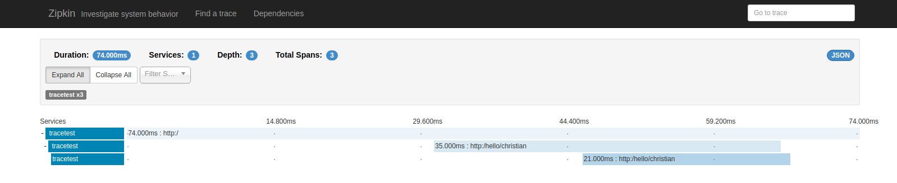

# Demo for spring sleuth and zipkin

Shows how spring boot applications can be instrumented using spring sleuth to send tracing information to zipkin.

## Installation

Run zipkin docker image with a REST receiver, in memory storage and the zipkin UI
    docker run -d -p 9411:9411 openzipkin/zipkin
    
Run tracing demo application
    cd tracing
    mvn spring-boot:run
    
Now use the browser to call the URI
    http://localhost:8080

The browser should show "Hello Christian".

## What happens behind the scenes

The browser calls a REST service implemented by the tracing spring boot application.
Inside the REST service a second hello REST service is called using the RestTemplate.
The second service recevies the name as a parameter and adds it as a span tag.

All the calls should be logged to zipkin and be available there as a trace.

## Check in zipkin

Start the zipkin UI
    http://localhost:9411/
    
Click find trace. If it shows no trace use a wider range in the dates.

You should see one trace with three spans.
The outermost span is the call the the top level rest service by the browser.
The second span is the call using the RestTemplate. You should see four events in it for the messages during the REST call.
The third span is the call to the hello service. There you should see the tag name=Christian.
